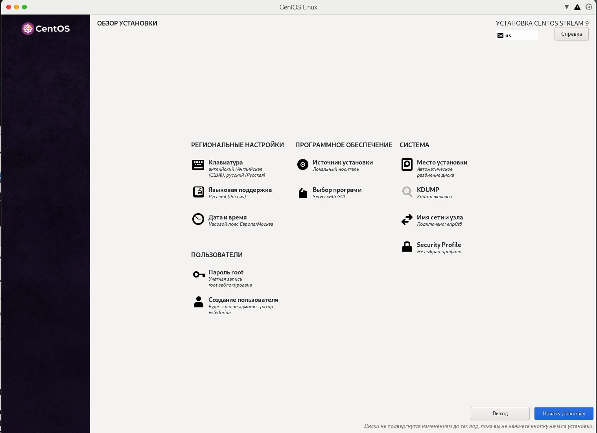
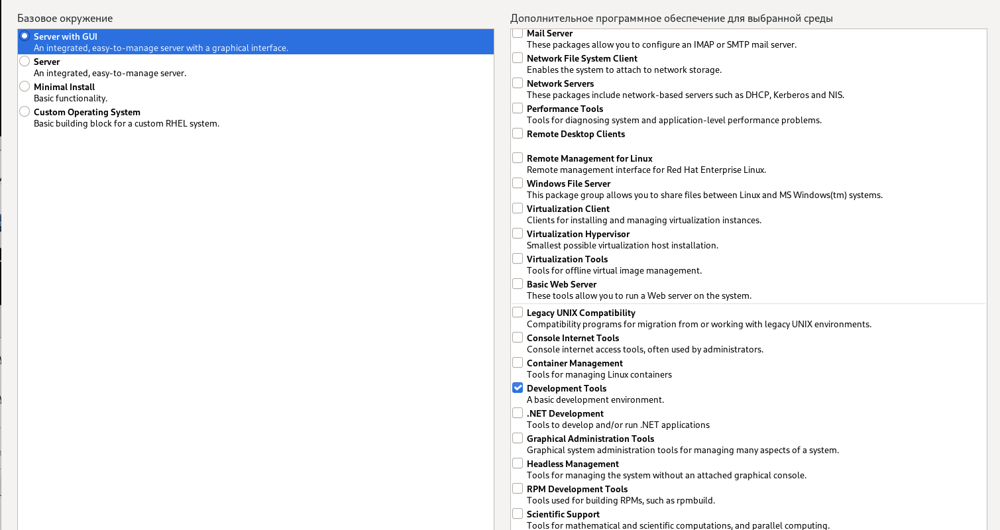
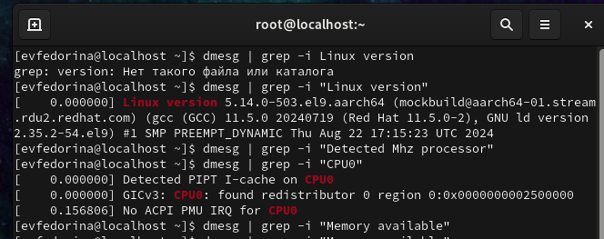
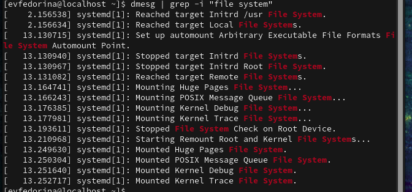

---
## Front matter
lang: ru-RU
title: Лабораторная работа №1
subtitle:   Установка и конфигурация операционной системы на виртуальную машину
author:
  - Федорина Эрнест Васильевич
institute:
  - Российский университет дружбы народов, Москва, Россия

## i18n babel
babel-lang: russian
babel-otherlangs: english

## Formatting pdf
toc: false
toc-title: Содержание
slide_level: 2
aspectratio: 169
section-titles: true
theme: metropolis
header-includes:
 - \metroset{progressbar=frametitle,sectionpage=progressbar,numbering=fraction}
 - '\makeatletter'
 - '\beamer@ignorenonframefalse'
 - '\makeatother'
---

# Информация

## Докладчик

:::::::::::::: {.columns align=center}
::: {.column width="45%"}

  * Федорина Эрнест Васильевич
  * студент
  * Российский университет дружбы народов
  * [1032216454@pfur.ru](mailto:1032216454@pfur.ru)
  * <https://evfedorina.github.io/ru/>

:::
::: {.column width="25%"}

:::
::::::::::::::
## Цель работы

Приобретение практических навыков
установки операционной системы на виртуальную машину, настройки минимально необходимых для дальнейшей работы сервисов.

## Техническое обеспечение

Я буду работать в виртуальной машине, которая будет базироваться на операционной системе CentOS 9

# Выполнение лабораторной работы

## Установка системы

Я скачал образ системы и начал её установку (рис. [-@fig:001], [-@fig:002], [-@fig:003])

## Установка системы

{#fig:001 width=50%}

## Установка системы

{#fig:002 width=50%}

## Установка системы

{#fig:003 width=50%}

## Команды с информацией о системе

Далее прописали несколько команд с выяснением информации о системе(рис. [-@fig:004], [-@fig:005], [-@fig:006])

## Команды с информацией о системе

{#fig:004 width=50%}

## Команды с информацией о системе

{#fig:005 width=50%}

## Команды с информацией о системе

{#fig:006 width=50%}

# Выводы

Приобрели практические навыки установки операционной системы на виртуальную машину, настройки минимально необходимых для дальнейшей работы сервисов.

