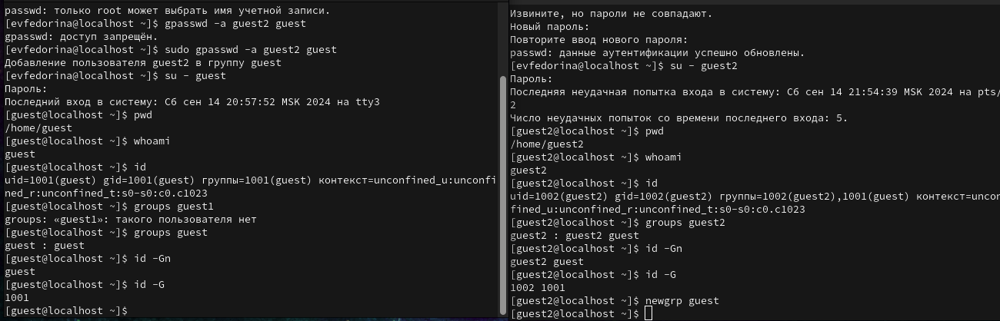
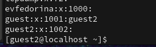
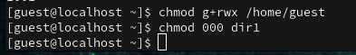

---
## Front matter
lang: ru-RU
title: Лабораторная работа №3
subtitle:   Дискреционное разграничение прав в Linux. Два пользователя
author:
  - Федорина Эрнест Васильевич
institute:
  - Российский университет дружбы народов, Москва, Россия

## i18n babel
babel-lang: russian
babel-otherlangs: english

## Formatting pdf
toc: false
toc-title: Содержание
slide_level: 2
aspectratio: 169
section-titles: true
theme: metropolis
header-includes:
 - \metroset{progressbar=frametitle,sectionpage=progressbar,numbering=fraction}
 - '\makeatletter'
 - '\beamer@ignorenonframefalse'
 - '\makeatother'
---

# Информация

## Докладчик

:::::::::::::: {.columns align=center}
::: {.column width="45%"}

  * Федорина Эрнест Васильевич
  * студент
  * Российский университет дружбы народов
  * [1032216454@pfur.ru](mailto:1032216454@pfur.ru)
  * <https://evfedorina.github.io/ru/>

:::
::: {.column width="25%"}

:::
::::::::::::::

## Цель работы

Получение практических навыков работы в консоли с атрибутами файлов для групп пользователей.

## Теоретическое введение

chmod (от англ. change mode) — команда для изменения прав доступа к файлам и каталогам, используемая в Unix-подобных операционных системах. Входит в стандарт POSIX, в Coreutils.

# Выполнение лабораторной работы

## Создание двух пользователей, работа с группами и получение информации об этих пользователях

Для начала создадим двух  пользователей, зададим им пароли, а также добавим пользователя guest2 в группу guest. Затем зайдём в разные учётные записи с разных консолей и посмотрим на директорию, в которой находимся, а также  уточним некоторую информацию о пользователях, например имя, id и тд.  (рис. [-@fig:001])

## Создание двух пользователей, работа с группами и получение информации об этих пользователях

{#fig:001 width=50%}

## Сравнение информации о пользователях

Сравним полученную информацию с содержимым файла group. Данные о пользователях идентичны. (рис. [-@fig:002])

{#fig:002 width=50%}

## Работа с правами от имени пользователя guest

От имени пользователя guest изменим права директории /home/guest, а также снимем с директории dir1 все атрибуты  (рис. [-@fig:003])

{#fig:003 width=50%}

## Заполненная таблица для задания 3.1

| Права директории | Права файла | Создание файла | Удаление файла | Запись в файл | Чтение файла | Смена директории | Просмотр файлов в директории | Переименование файла | Смена атрибутов файла |
|-------------|-------------|-------------|-------------|-------------|-------------|-------------|-------------|-------------|-------------|
|  d(000)  |  (000)  |  -  |  -  |  -  |  -  |  -  |  -  |  -  |  -  |
|  d(100)  |  (000)  |  -  |  -  |  -  |  -  |  +  |  -  |  -  |  +  |
|  d(200)  |  (000)  |  -  |  -  |  -  |  -  |  -  |  -  |  -  |  -  |
|  d(300)  |  (000)  |  +  |  +  |  -  |  -  |  +  |  -  |  +  |  +  |
|  d(400)  |  (000)  |  -  |  -  |  -  |  -  |  -  |  +  |  -  |  -  |
|  d(500)  |  (000)  |  -  |  -  |  -  |  -  |  -  |  +  |  -  |  +  |
|  d(600)  |  (000)  |  -  |  -  |  -  |  -  |  +  |  +  |  -  |  -  |
|  d(700)  |  (000)  |  +  |  - |  -  |  -  |  +  |  +  |  +  |  +  |
|  d(000)  |  (100)  |  -  |  -  |  -  |  -  |  -  |  -  |  -  |  -  |
|  d(000)  |  (200)  |  -  |  -  |  -  |  -  |  -  |  -  |  -  |  -  |
|  d(000)  |  (300)  |  -  |  -  |  -  |  -  |  -  |  -  |  -  |  -  |
|  d(000)  |  (400)  |  -  |  -  |  -  |  -  |  -  |  -  |  -  |  -  |
|  d(000)  |  (500)  |  -  |  -  |  -  |  -  |  -  |  -  |  -  |  -  |
|  d(000)  |  (600)  |  -  |  -  |  -  |  -  |  -  |  -  |  -  |  -  |
|  d(000)  |  (700)  |  -  |  -  |  -  |  -  |  -  |  -  |  -  |  -  |
|  d(100)  |  (100)  |  -  |  -  |  -  |  -  |  -  |  -  |  -  |  +  |
|  d(100)  |  (200)  |  -  |  -  |  +  |  -  |  +  |  -  |  -  |  +  |
|  d(100)  |  (300)  |  -  |  -  |  +  |  -  |  +  |  -  |  -  |  +  |
|  d(100)  |  (400)  |  -  |  -  |  -  |  +  |  +  |  -  |  -  |  +  |
|  d(100)  |  (500)  |  -  |  -  |  -  |  +  |  +  |  -  |  -  |  +  |
|  d(100)  |  (600)  |  -  |  -  |  +  |  +  |  +  |  -  |  -  |  +  |
|  d(100)  |  (700)  |  -  |  -  |  +  |  +  |  +  |  -  |  -  |  +  |
|  d(200)  |  (100)  |  -  |  -  |  -  |  -  |  -  |  -  |  -  |  -  |
|  d(200)  |  (200)  |  -  |  -  |  -  |  -  |  -  |  -  |  -  |  -  |
|  d(200)  |  (300)  |  -  |  -  |  -  |  -  |  -  |  -  |  -  |  -  |
|  d(200)  |  (400)  |  -  |  -  |  -  |  -  |  -  |  -  |  -  |  -  |
|  d(200)  |  (500)  |  -  |  -  |  -  |  -  |  -  |  -  |  -  |  -  |
|  d(200)  |  (600)  |  -  |  -  |  -  |  -  |  -  |  -  |  -  |  -  |
|  d(200)  |  (700)  |  -  |  -  |  -  |  -  |  -  |  -  |  -  |  -  |
|  d(300)  |  (100)  |  +  |  +  |  -  |  -  |  +  |  -  |  +  |  +  |
|  d(300)  |  (200)  |  +  |  +  |  +  |  -  |  +  |  -  |  +  |  +  |
|  d(300)  |  (300)  |  +  |  +  |  +  |  -  |  +  |  -  |  +  |  +  |
|  d(300)  |  (400)  |  +  |  +  |  -  |  +  |  +  |  -  |  +  |  +  |
|  d(300)  |  (500)  |  +  |  +  |  -  |  +  |  +  |  -  |  +  |  +  |
|  d(300)  |  (600)  |  +  |  +  |  +  |  +  |  +  |  -  |  +  |  +  |
|  d(300)  |  (700)  |  +  |  +  |  +  |  +  |  +  |  -  |  +  |  +  |
|  d(400)  |  (100)  |  -  |  -  |  -  |  -  |  -  |  +  |  -  |  -  |
|  d(400)  |  (200)  |  -  |  -  |  -  |  -  |  -  |  +  |  -  |  -  |
|  d(400)  |  (300)  |  -  |  -  |  -  |  -  |  -  |  +  |  -  |  -  |
|  d(400)  |  (400)  |  -  |  -  |  -  |  -  |  -  |  +  |  -  |  -  |
|  d(400)  |  (500)  |  -  |  -  |  -  |  -  |  -  |  +  |  -  |  -  |
|  d(400)  |  (600)  |  -  |  -  |  -  |  -  |  -  |  +  |  -  |  -  |
|  d(400)  |  (700)  |  -  |  -  |  -  |  -  |  -  |  +  |  -  |  -  |
|  d(500)  |  (100)  |  -  |  -  |  -  |  -  |  +  |  +  |  -  |  +  |
|  d(500)  |  (200)  |  -  |  -  |  +  |  -  |  +  |  +  |  -  |  +  |
|  d(500)  |  (300)  |  -  |  -  |  +  |  -  |  +  |  +  |  -  |  +  |
|  d(500)  |  (400)  |  -  |  -  |  -  |  +  |  +  |  +  |  -  |  +  |
|  d(500)  |  (500)  |  -  |  -  |  -  |  +  |  +  |  +  |  -  |  +  |
|  d(500)  |  (600)  |  -  |  -  |  +  |  +  |  +  |  +  |  -  |  +  |
|  d(500)  |  (700)  |  -  |  -  |  +  |  +  |  +  |  +  |  -  |  +  |
|  d(600)  |  (100)  |  -  |  -  |  -  |  -  |  -  |  +  |  -  |  -  |
|  d(600)  |  (200)  |  -  |  -  |  -  |  -  |  -  |  +  |  -  |  -  |
|  d(600)  |  (300)  |  -  |  -  |  -  |  -  |  -  |  +  |  -  |  -  |
|  d(600)  |  (400)  |  -  |  -  |  -  |  -  |  -  |  +  |  -  |  -  |
|  d(600)  |  (500)  |  -  |  -  |  -  |  -  |  -  |  +  |  -  |  -  |
|  d(600)  |  (600)  |  -  |  -  |  -  |  -  |  -  |  +  |  -  |  -  |
|  d(600)  |  (700)  |  -  |  -  |  -  |  -  |  -  |  +  |  -  |  -  |
|  d(700)  |  (100)  |  +  |  +  |  -  |  -  |  +  |  +  |  +  |  +  |
|  d(700)  |  (200)  |  +  |  +  |  -  |  -  |  +  |  +  |  +  |  +  |
|  d(700)  |  (300)  |  +  |  +  |  +  |  -  |  +  |  +  |  +  |  +  |
|  d(700)  |  (400)  |  +  |  +  |  -  |  +  |  +  |  +  |  +  |  +  |
|  d(700)  |  (500)  |  +  |  +  |  -  |  +  |  +  |  +  |  +  |  +  |
|  d(700)  |  (600)  |  +  |  +  |  +  |  +  |  +  |  +  |  +  |  +  |
|  d(700)  |  (700)  |  -  |  -  |  -  |  -  |  -  |  -  |  -  |  -  |

## Заполненная таблица 3.2

| Операция | Минимальные права на директорию | Минимальные права на файл |
|------------|-------------|-------------|
|  Создание файла  |  d(300)  | (000)  |
|  Удаление файла  |  d(300)  | (000)  |
|  Чтение файла  |  d(100)  | (400)  |
| Запись в файл  |  d(100)  | (200)  |
| Переименование файла  |  d(300)  | (000)  |
| Создание поддиректории  |  d(300)  | (000)  |
| Удаление поддиректории  |  d(300)  | (000)  |

# Выводы

Получили практические навыки работы в консоли с атрибутами файлов для групп пользователей.

# Список литературы:

1. Chmod[Электронный ресурс] - https://en.wikipedia.org/wiki/Chmod
