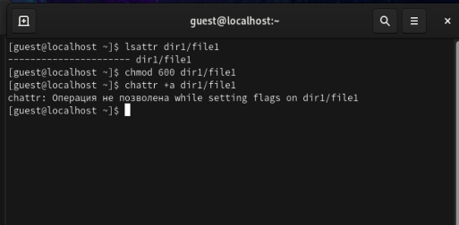
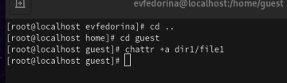
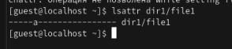
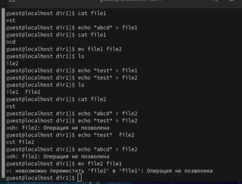
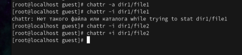

---
## Front matter
lang: ru-RU
title: Лабораторная работа №4
subtitle:   Дискреционное разграничение прав в Linux. Расширенные атрибуты
author:
  - Федорина Эрнест Васильевич
institute:
  - Российский университет дружбы народов, Москва, Россия

## i18n babel
babel-lang: russian
babel-otherlangs: english

## Formatting pdf
toc: false
toc-title: Содержание
slide_level: 2
aspectratio: 169
section-titles: true
theme: metropolis
header-includes:
 - \metroset{progressbar=frametitle,sectionpage=progressbar,numbering=fraction}
 - '\makeatletter'
 - '\beamer@ignorenonframefalse'
 - '\makeatother'
---

# Информация

## Докладчик

:::::::::::::: {.columns align=center}
::: {.column width="45%"}

  * Федорина Эрнест Васильевич
  * студент
  * Российский университет дружбы народов
  * [1032216454@pfur.ru](mailto:1032216454@pfur.ru)
  * <https://evfedorina.github.io/ru/>

:::
::: {.column width="25%"}

:::
::::::::::::::

## Цель работы

Получение практических навыков работы в консоли с расширенными атрибутами файлов

## Теоретическое введение

chmod (от англ. change mode) — команда для изменения прав доступа к файлам и каталогам, используемая в Unix-подобных операционных системах. Входит в стандарт POSIX, в Coreutils.

# Выполнение лабораторной работы

## Первоначальная работа с атрибутами и правами

Для начала мы определим расширенные атрибуты файла file1, установим на файл определённые права командой chmod, а также попытаемся установить расширенный атрибут +а, от имени пользователя guest  (рис. [-@fig:001])

## Первоначальная работа с атрибутами и правами

{#fig:001 width=45%}

## Первоначальная работа с атрибутами и правами

Как мы видим, установить атрибут пользователем guest не получается.

Установим атрибут с помощью учётной записи root (рис. [-@fig:002])

## Использование root пользователя для выставления атрибута

{#fig:002 width=45%}

## Работа с атрибутами и выяснение возможностей работы с файлом

Проверили правильность установления атрибута (рис. [-@fig:003])

{#fig:003 width=45%}

## Работа с атрибутами и выяснение возможностей работы с файлом

Проверили правильность установления атрибута (рис. [-@fig:003])

Далее мы поработали с файлами -  записывали, переименовывали и очищали содержимое файла file1 (file2). Затем снимали атрибут +a, и проделывали все шаги с атрибутом +i и без него (рис. [-@fig:004]). Для этого приходилось ставить атрибуты с помощью пользователя root (рис. [-@fig:005]).

## Работа с атрибутами и выяснение возможностей работы с файлом

{#fig:004 width=50%}

## Работа с атрибутами и выяснение возможностей работы с файлом

{#fig:005 width=50%}

## Что стало понятно про атрибуты

По итогу можно сказать, что выставление атрибутов +a или +i  позволяет совершать множество манипуляций над файлами. Например, у нас получилось очистить содержимое файла или переименовать его.

# Выводы

Получил практические навыки работы в консоли с расширенными атрибутами файлов

# Список литературы:

1. Chmod[Электронный ресурс] - https://en.wikipedia.org/wiki/Chmod
