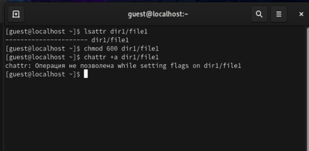
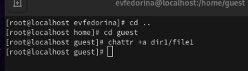
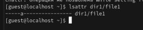
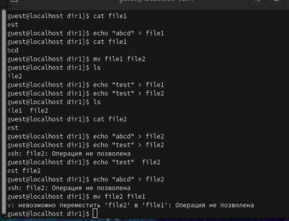
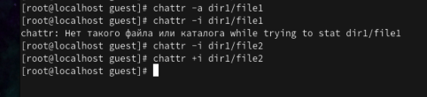

---
## Front matter
title: "Отчёт по лабораторной работе №4"
subtitle: "Дискреционное разграничение прав в Linux. Расширенные атрибуты"
author: "Федорина Эрнест Василевич"

## Generic otions
lang: ru-RU
toc-title: "Содержание"

## Bibliography
bibliography: bib/cite.bib
csl: pandoc/csl/gost-r-7-0-5-2008-numeric.csl

## Pdf output format
toc: true # Table of contents
toc-depth: 2
lof: true # List of figures
lot: true # List of tables
fontsize: 12pt
linestretch: 1.5
papersize: a4
documentclass: scrreprt
## I18n polyglossia
polyglossia-lang:
  name: russian
  options:
	- spelling=modern
	- babelshorthands=true
polyglossia-otherlangs:
  name: english
## I18n babel
babel-lang: russian
babel-otherlangs: english
## Fonts
mainfont: PT Serif
romanfont: PT Serif
sansfont: PT Sans
monofont: PT Mono
mainfontoptions: Ligatures=TeX
romanfontoptions: Ligatures=TeX
sansfontoptions: Ligatures=TeX,Scale=MatchLowercase
monofontoptions: Scale=MatchLowercase,Scale=0.9
## Biblatex
biblatex: true
biblio-style: "gost-numeric"
biblatexoptions:
  - parentracker=true
  - backend=biber
  - hyperref=auto
  - language=auto
  - autolang=other*
  - citestyle=gost-numeric
## Pandoc-crossref LaTeX customization
figureTitle: "Рис."
tableTitle: "Таблица"
listingTitle: "Листинг"
lofTitle: "Список иллюстраций"
lotTitle: "Список таблиц"
lolTitle: "Листинги"
## Misc options
indent: true
header-includes:
  - \usepackage{indentfirst}
  - \usepackage{float} # keep figures where there are in the text
  - \floatplacement{figure}{H} # keep figures where there are in the text
---

# Цель работы

Получение практических навыков работы в консоли с расширенными атрибутами файлов

# Теоретическое введение

chmod (от англ. change mode) — команда для изменения прав доступа к файлам и каталогам, используемая в Unix-подобных операционных системах. Входит в стандарт POSIX, в Coreutils.[@wiki:bash].

# Выполнение лабораторной работы

Для начала мы определим расширенные атрибуты файла file1, установим на файл определённые права командой chmod, а также попытаемся установить расширенный атрибут +а, от имени пользователя guest  (рис. [-@fig:001])

{#fig:001 width=70%}

Как мы видим, установить атрибут пользователем guest не получается.

Установим атрибут с помощью учётной записи root (рис. [-@fig:002])

{#fig:002 width=70%}

Проверили правильность установления атрибута (рис. [-@fig:003])

{#fig:003 width=70%}

Проверили правильность установления атрибута (рис. [-@fig:003])

Далее мы поработали с файлами -  записывали, переименовывали и очищали содержимое файла file1 (file2). Затем снимали атрибут +a, и проделывали все шаги с атрибутом +i и без него (рис. [-@fig:004]). Для этого приходилось ставить атрибуты с помощью пользователя root (рис. [-@fig:005]).

{#fig:004 width=70%}

{#fig:005 width=70%}

По итогу можно сказать, что выставление атрибутов +a или +i  позволяет совершать множество манипуляций над файлами. Например, у нас получилось очистить содержимое файла или переименовать его.

# Выводы

Получил практические навыкои работы в консоли с расширенными атрибутами файлов

# Список литературы{.unnumbered}

::: {#refs}
:::
