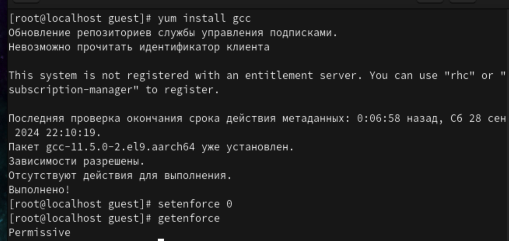
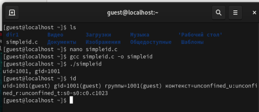
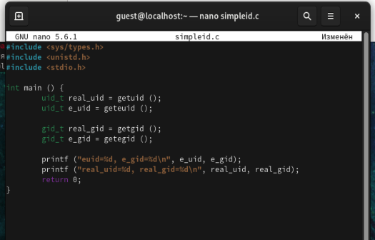
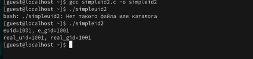
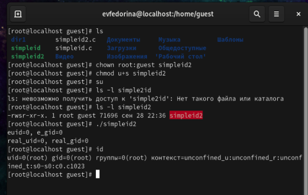
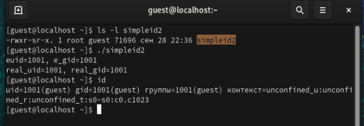
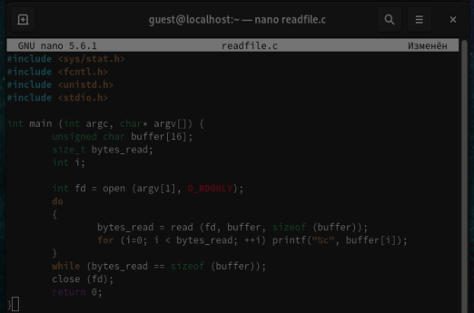
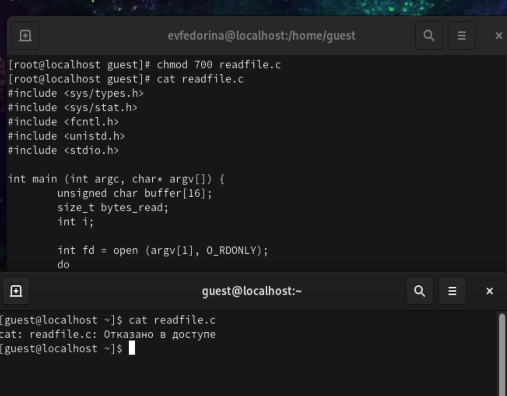
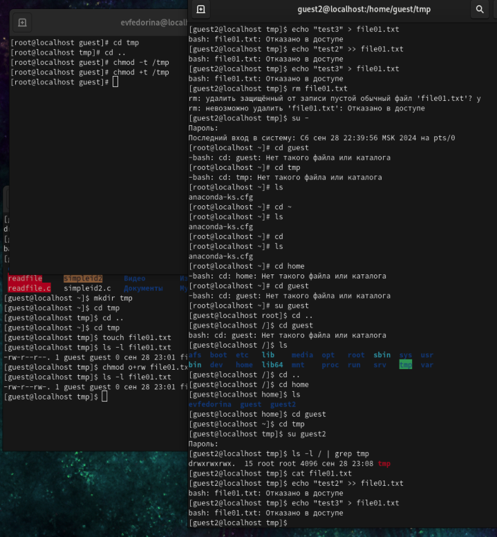

---
## Front matter
lang: ru-RU
title: Лабораторная работа №5
subtitle:  Дискреционное разграничение прав в Linux. Исследование влияния дополнительных атрибутов
author:
  - Федорина Эрнест Васильевич
institute:
  - Российский университет дружбы народов, Москва, Россия

## i18n babel
babel-lang: russian
babel-otherlangs: english

## Formatting pdf
toc: false
toc-title: Содержание
slide_level: 2
aspectratio: 169
section-titles: true
theme: metropolis
header-includes:
 - \metroset{progressbar=frametitle,sectionpage=progressbar,numbering=fraction}
 - '\makeatletter'
 - '\beamer@ignorenonframefalse'
 - '\makeatother'
---

# Информация

## Докладчик

:::::::::::::: {.columns align=center}
::: {.column width="45%"}

  * Федорина Эрнест Васильевич
  * студент
  * Российский университет дружбы народов
  * [1032216454@pfur.ru](mailto:1032216454@pfur.ru)
  * <https://evfedorina.github.io/ru/>

:::
::: {.column width="25%"}

:::
::::::::::::::

## Цель работы

Изучение механизмов изменения идентификаторов, применения SetUID- и Sticky-битов. Получение практических навыков работы в консоли с дополнительными атрибутами. Рассмотрение работы механизма смены идентификатора процессов пользователей, а также влияние бита Sticky на запись и удаление файлов.

## Теоретическое введение

chmod (от англ. change mode) — команда для изменения прав доступа к файлам и каталогам, используемая в Unix-подобных операционных системах. Входит в стандарт POSIX, в Coreutils.

# Выполнение лабораторной работы

## Есть ли gcc в системе

Для начала мы проверим наличие gcc и сделаем так, чтобы система защиты SELinux не мешала выполнению работы (рис. [-@fig:001])

{#fig:001 width=45%}

## Работа с simpleid.c

Создадим файл simpleid.c, напишем код  в нём, а далее скомпилируем и запустим, сравним с выполнением команды id. Наш файл работает идентично и выдаёт ID пользователя (рис. [-@fig:002])

{#fig:002 width=45%}

## Работа с simpleid2.c

Изменим код, добавив вывод дополнительных идентификаторов и запустим программу (рис. [-@fig:003], [-@fig:004])

{#fig:003 width=45%}

## Работа с simpleid2.c

{#fig:004 width=45%}

## Работа с simpleid2.c

Выполним несколько команд от имени суперпользователя, проверим правильность установки новых атрибутов и смены владельца файла, а также ещё раз запустим файл и сравним его работу с командой id. Выдают идентичные результаты (рис. [-@fig:005])

## Работа с simpleid2.c

{#fig:005 width=50%}

## Работа с simpleid2.c

Проделаем то же самое с помощью SetGID-бита (рис. [-@fig:006])

{#fig:006 width=45%}

## Работа с readfile.c

Напишем код для файла readfile.c (рис. [-@fig:007])

{#fig:007 width=45%}

## Работа с readfile.c

Сменим владельца, чтобы прочитать файл мог только суперпользователь. Попробуем прочитать файл от имени guest. Отказывает в доступе. Далее сменим владельца и установим SetUID-бит, проверим чтение файла, получилось (рис. [-@fig:008])

## Работа с readfile.c

{#fig:008 width=50%}

## Работа со Sticky-битом

Исследуем Sticky-бит (рис. [-@fig:009])

{#fig:009 width=40%}

# Выводы

Изучил механизмы изменения идентификаторов, применения SetUID- и Sticky-битов. Получил практические навыки работы в консоли с дополнительными атрибутами. Рассмотрел работы механизма смены идентификатора процессов пользователей, а также влияние бита Sticky на запись и удаление файлов.

# Список литературы:

1. Chmod[Электронный ресурс] - https://en.wikipedia.org/wiki/Chmod
