---
## Front matter
lang: ru-RU
title: Лабораторная работа №6
subtitle: Мандатное разграничение прав в Linux
author:
  - Федорина Эрнест Васильевич
institute:
  - Российский университет дружбы народов, Москва, Россия

## i18n babel
babel-lang: russian
babel-otherlangs: english

## Formatting pdf
toc: false
toc-title: Содержание
slide_level: 2
aspectratio: 169
section-titles: true
theme: metropolis
header-includes:
 - \metroset{progressbar=frametitle,sectionpage=progressbar,numbering=fraction}
 - '\makeatletter'
 - '\beamer@ignorenonframefalse'
 - '\makeatother'
---

# Информация

## Докладчик

:::::::::::::: {.columns align=center}
::: {.column width="45%"}

  * Федорина Эрнест Васильевич
  * студент
  * Российский университет дружбы народов
  * [1032216454@pfur.ru](mailto:1032216454@pfur.ru)
  * <https://evfedorina.github.io/ru/>

:::
::: {.column width="25%"}

:::
::::::::::::::

## Цель работы

Развить навыки администрирования ОС Linux. Получить первое практическое знакомство с технологией SELinux.
Проверить работу SELinx на практике совместно с веб-сервером Apache.

## Теоретическое введение

Apache HTTP-сервер (в иронической трактовке является искажённым сокращением от англ. a patchy server; среди русских пользователей общепринято переводное апа́ч) — свободный веб-сервер.

# Выполнение лабораторной работы

## Организация рабочего стенда

Для начала организуем рабочий стренд, - установим apache, проверим используемый режим и политику, а также отключим некоторые пакетные фильтры (рис. [-@fig:001])

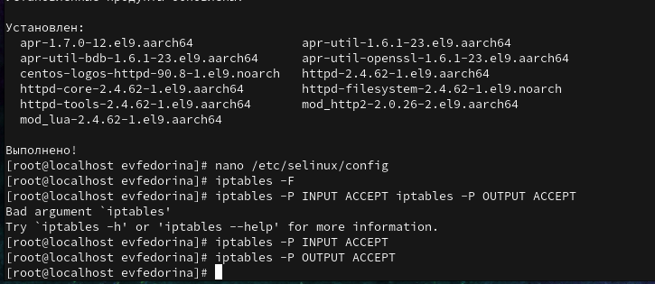{#fig:001 width=45%}

## Старт работы веб-сервера

Увидели, что веб-сервер не работает (рис. [-@fig:002]), включили его (рис. [-@fig:003]) и посмотрели контекст безопасности (рис. [-@fig:004])

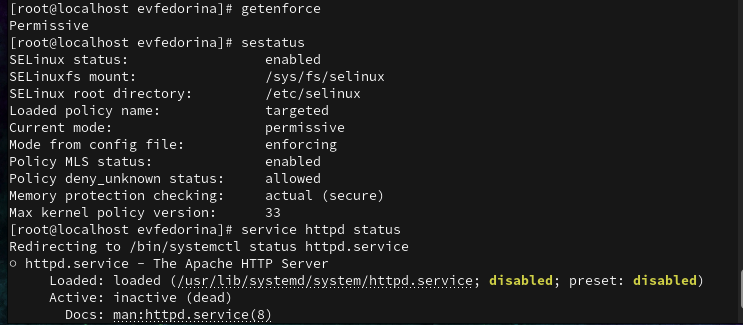{#fig:002 width=40%}

## Старт работы веб-сервера

{#fig:003 width=60%}

## Старт работы веб-сервера

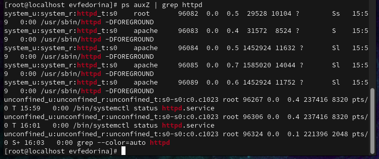{#fig:004 width=60%}

## Просмотр состояния переключателей

Потом посмотрели состояние переключателей (рис. [-@fig:005])

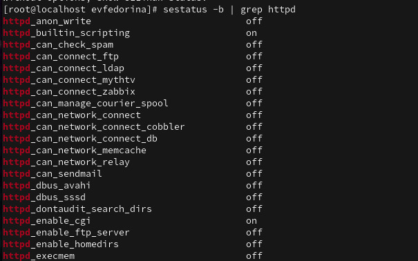{#fig:005 width=45%}

## Статистика по политике

Далее посмотрим статистику по политике (рис. [-@fig:006])

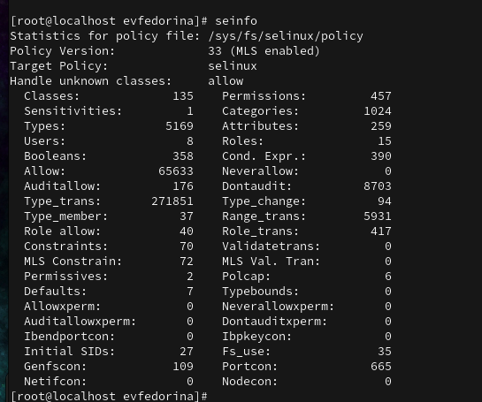{#fig:006 width=45%}

## Старт работы веб-сервера

У нас 8 пользователей, 5169 типов и 15 ролей.

## Начало работы с файлом test.html

Определим тип файлов в директории /var/www/html, создадим там файл test.html и проверим его контекст (рис. [-@fig:007])

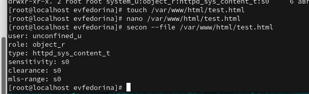{#fig:007 width=45%}

## Начало работы с файлом test.html

Обратимся к файлу через веб-сервер и увидим там текст, написанный нами ранее в файле test.html, доступ есть (рис. [-@fig:008])

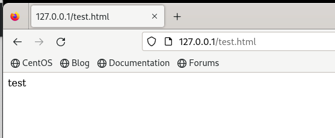{#fig:008 width=45%}

## Работа с контекстами

Изучив справку httpd_selinux мы выяснили нужные контексты, сопоставили их с контекстами нашего файла, рассмотреои полученный контекст детально, а потом изменили контекст файла, чтобы процесс httpd не имел доступа к файлу (рис. [-@fig:009])

## Работа с контекстами

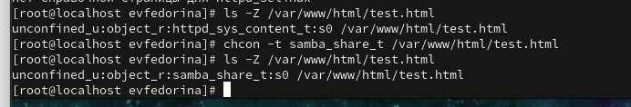{#fig:009 width=60%}

## Просмотр log-файлов

Смотрим log-файлы веб-сервера и системные логи (рис. [-@fig:010])

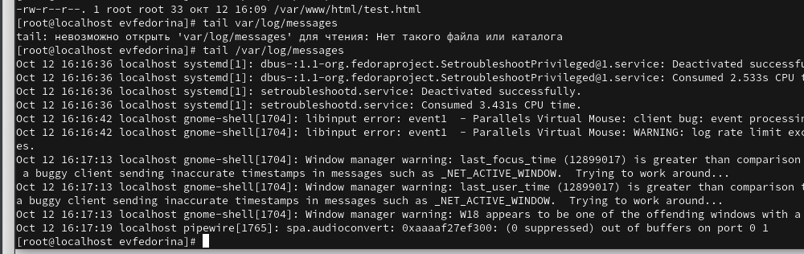{#fig:010 width=45%}

## Просмотр log-файлов и изменение параметра listen

В httpd.conf изменили параметр listen с 80 на 81, потом перезапустили веб-сервер, произошёл сбой.

Далее мы опять посмотрели log-файлы (рис. [-@fig:011])

## Просмотр log-файлов и изменение параметра listen

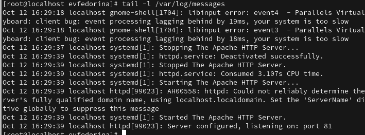{#fig:011 width=60%}

## Использование команды semanage port и просмотр log-файлов

Выполнили команду semanage port, проверили список портов и увидели там 81, а затем снова запустили веб-сервер Apache, успешно (рис. [-@fig:012])

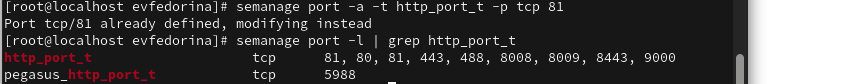{#fig:012 width=45%}

## Завершение лабораторной работы

В конце лабораторной работы убрали все изменения в файлах, удалили test.html и удалили привязку httpd_port_t к 81 порту

# Выводы

Развили навыки администрирования ОС Linux. Получили первое практическое знакомство с технологией SELinux.
Проверили работу SELinx на практике совместно с веб-сервером Apache.

# Список литературы:

1. Apache[Электронный ресурс] - https://ru.wikipedia.org/wiki/Apache
