---
## Front matter
title: "Отчёт по лабораторной работе №6"
subtitle: "Мандатное разграничение прав в Linux"
author: "Федорина Эрнест Василевич"

## Generic otions
lang: ru-RU
toc-title: "Содержание"

## Bibliography
bibliography: bib/cite.bib
csl: pandoc/csl/gost-r-7-0-5-2008-numeric.csl

## Pdf output format
toc: true # Table of contents
toc-depth: 2
lof: true # List of figures
lot: true # List of tables
fontsize: 12pt
linestretch: 1.5
papersize: a4
documentclass: scrreprt
## I18n polyglossia
polyglossia-lang:
  name: russian
  options:
	- spelling=modern
	- babelshorthands=true
polyglossia-otherlangs:
  name: english
## I18n babel
babel-lang: russian
babel-otherlangs: english
## Fonts
mainfont: PT Serif
romanfont: PT Serif
sansfont: PT Sans
monofont: PT Mono
mainfontoptions: Ligatures=TeX
romanfontoptions: Ligatures=TeX
sansfontoptions: Ligatures=TeX,Scale=MatchLowercase
monofontoptions: Scale=MatchLowercase,Scale=0.9
## Biblatex
biblatex: true
biblio-style: "gost-numeric"
biblatexoptions:
  - parentracker=true
  - backend=biber
  - hyperref=auto
  - language=auto
  - autolang=other*
  - citestyle=gost-numeric
## Pandoc-crossref LaTeX customization
figureTitle: "Рис."
tableTitle: "Таблица"
listingTitle: "Листинг"
lofTitle: "Список иллюстраций"
lotTitle: "Список таблиц"
lolTitle: "Листинги"
## Misc options
indent: true
header-includes:
  - \usepackage{indentfirst}
  - \usepackage{float} # keep figures where there are in the text
  - \floatplacement{figure}{H} # keep figures where there are in the text
---

# Цель работы

Развить навыки администрирования ОС Linux. Получить первое практическое знакомство с технологией SELinux.
Проверить работу SELinx на практике совместно с веб-сервером Apache.

# Теоретическое введение

Apache HTTP-сервер (в иронической трактовке является искажённым сокращением от англ. a patchy server; среди русских пользователей общепринято переводное апа́ч) — свободный веб-сервер.

Apache является кроссплатформенным ПО, поддерживает операционные системы Linux, BSD, macOS, Microsoft Windows, Novell NetWare, BeOS.

Основными достоинствами Apache считаются надёжность и гибкость конфигурации. Он позволяет подключать внешние модули для предоставления данных, использовать СУБД для аутентификации пользователей, модифицировать сообщения об ошибках и т.д.[@apache:bash].

# Выполнение лабораторной работы

Для начала организуем рабочий стренд, - установим apache, проверим используемый режим и политику, а также отключим некоторые пакетные фильтры (рис. [-@fig:001])

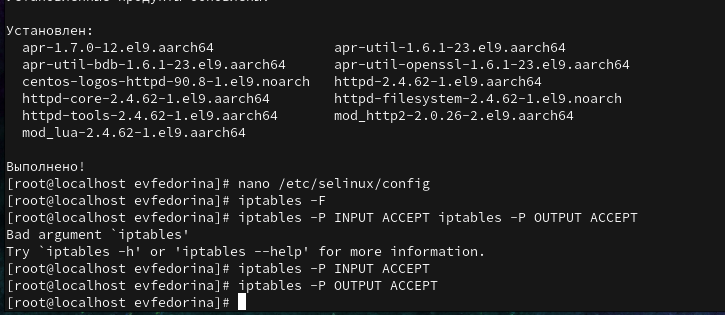{#fig:001 width=70%}

Увидели, что веб-сервер не работает (рис. [-@fig:002]), включили его (рис. [-@fig:003]) и посмотрели контекст безопасности (рис. [-@fig:004])

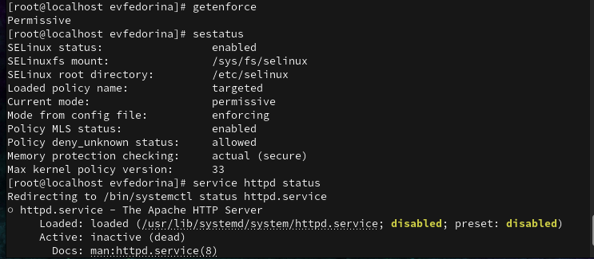{#fig:002 width=70%}

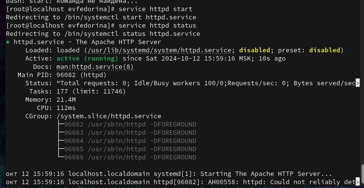{#fig:003 width=70%}

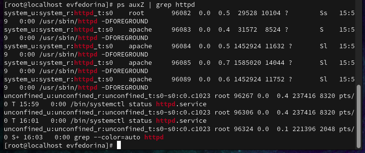{#fig:004 width=70%}

Потом посмотрели состояние переключателей (рис. [-@fig:005])

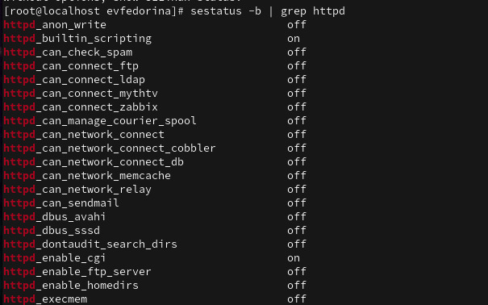{#fig:005 width=70%}

Далее посмотрим статистику по политике (рис. [-@fig:006])

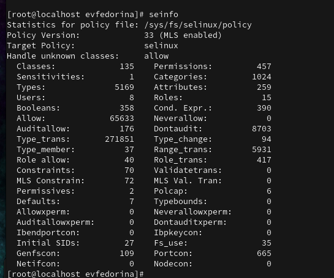{#fig:006 width=70%}

У нас 8 пользователей, 5169 типов и 15 ролей.

Определим тип файлов в директории /var/www/html, создадим там файл test.html и проверим его контекст (рис. [-@fig:007])

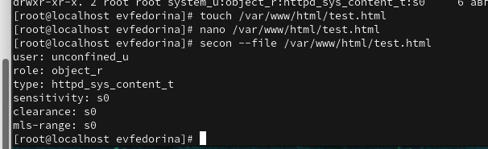{#fig:007 width=70%}

Обратимся к файлу через веб-сервер и увидим там текст, написанный нами ранее в файле test.html, доступ есть (рис. [-@fig:008])

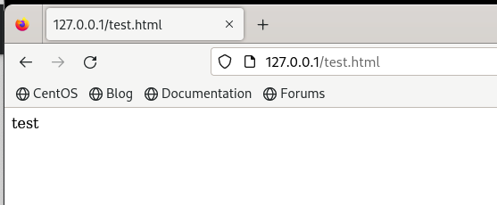{#fig:008 width=70%}

Изучив справку httpd_selinux мы выяснили нужные контексты, сопоставили их с контекстами нашего файла, рассмотреои полученный контекст детально, а потом изменили контекст файла, чтобы процесс httpd не имел доступа к файлу (рис. [-@fig:009])

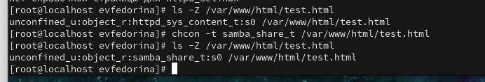{#fig:009 width=70%}

Смотрим log-файлы веб-сервера и системные логи (рис. [-@fig:010])

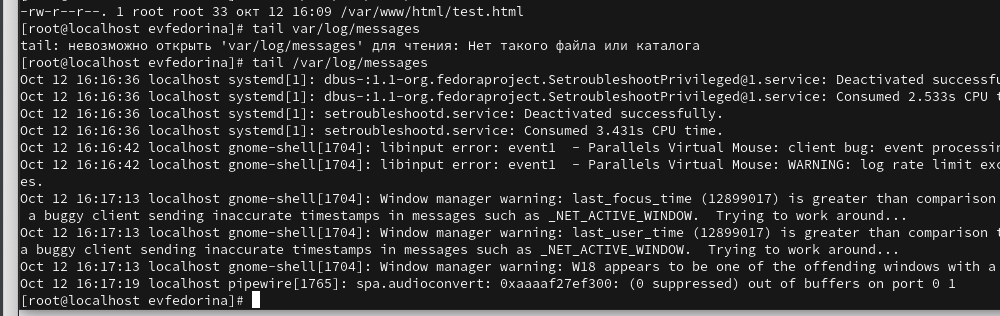{#fig:010 width=70%}

В httpd.conf изменили параметр listen с 80 на 81, потом перезапустили веб-сервер, произошёл сбой.

Далее мы опять посмотрели log-файлы (рис. [-@fig:011])

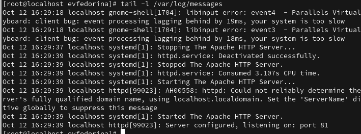{#fig:011 width=70%}

Выполнили команду semanage port, проверили список портов и увидели там 81, а затем снова запустили веб-сервер Apache, успешно (рис. [-@fig:012])

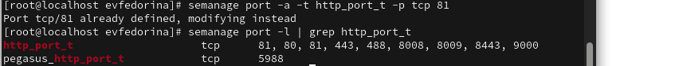{#fig:012 width=70%}

В конце лабораторной работы убрали все изменения в файлах, удалили test.html и удалили привязку httpd_port_t к 81 порту

# Выводы

Развили навыки администрирования ОС Linux. Получили первое практическое знакомство с технологией SELinux.
Проверили работу SELinx на практике совместно с веб-сервером Apache.

# Список литературы{.unnumbered}

::: {#refs}
:::
