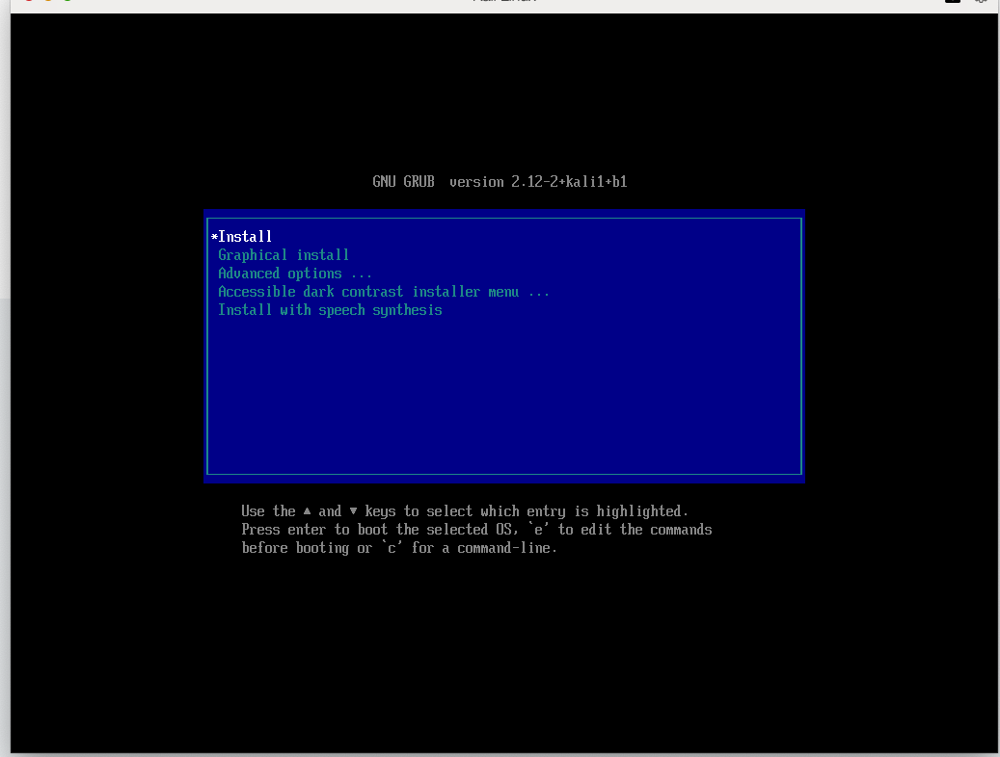
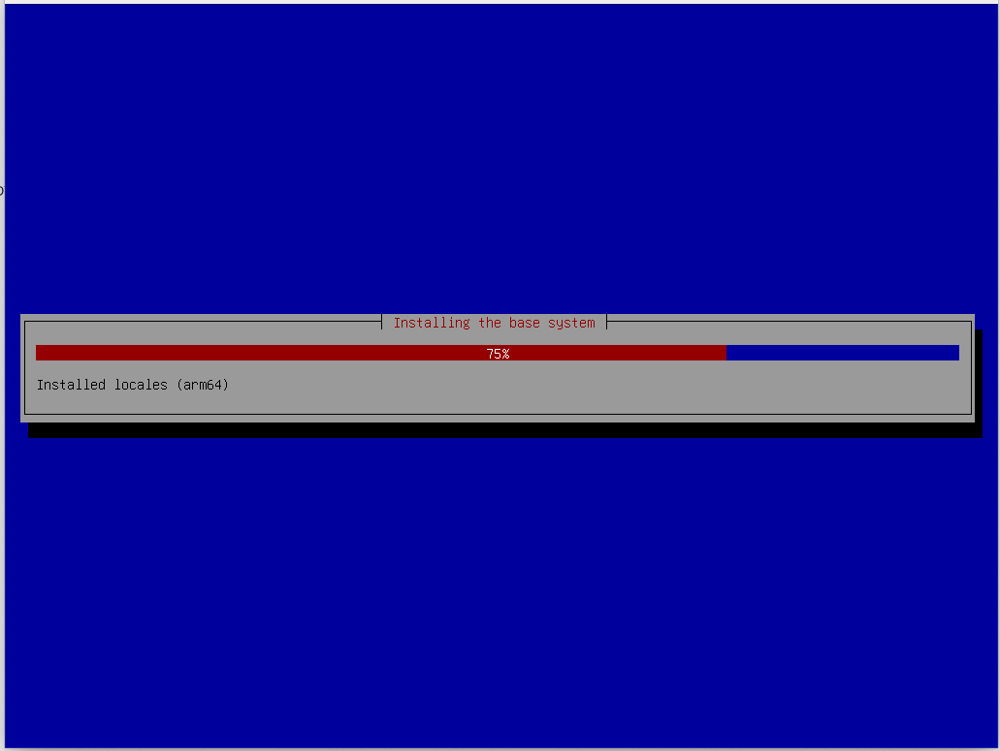
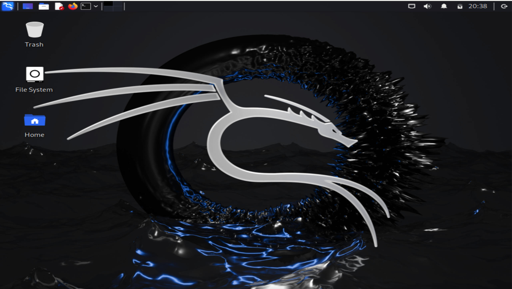

---
## Front matter
lang: ru-RU
title: Отчёт по 1 этапу индивидуального проекта
subtitle:   Установка Kali Linux
author:
  - Федорина Эрнест Васильевич
institute:
  - Российский университет дружбы народов, Москва, Россия

## i18n babel
babel-lang: russian
babel-otherlangs: english

## Formatting pdf
toc: false
toc-title: Содержание
slide_level: 2
aspectratio: 169
section-titles: true
theme: metropolis
header-includes:
 - \metroset{progressbar=frametitle,sectionpage=progressbar,numbering=fraction}
 - '\makeatletter'
 - '\beamer@ignorenonframefalse'
 - '\makeatother'
---

# Информация

## Докладчик

:::::::::::::: {.columns align=center}
::: {.column width="45%"}

  * Федорина Эрнест Васильевич
  * студент
  * Российский университет дружбы народов
  * [1032216454@pfur.ru](mailto:1032216454@pfur.ru)
  * <https://evfedorina.github.io/ru/>

:::
::: {.column width="25%"}

:::
::::::::::::::

## Цель работы

Установить дистрибутив Kali Linux в виртуальную машину.

## Теоретическое введение

Kali Linux — GNU/Linux-LiveCD, возникший как результат слияния WHAX и Auditor Security Collection. Проект создали Мати Ахарони (Mati Aharoni) и Макс Мозер (Max Moser). Предназначен прежде всего для проведения тестов на безопасность. Наследник развивавшегося до 2013 года на базе Knoppix дистрибутива BackTrack.

# Выполнение лабораторной работы

## Установка системы

Начало установки  (рис. [-@fig:001])

{#fig:001 width=70%}

## Установка системы

Установка Kali Linux (рис. [-@fig:002])

{#fig:003 width=70%}

## Установка системы

Завершили установку  (рис. [-@fig:003])

{#fig:003 width=70%}

# Выводы

Установили Kali Linux на виртуальную машину
