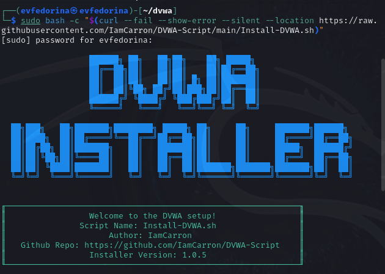
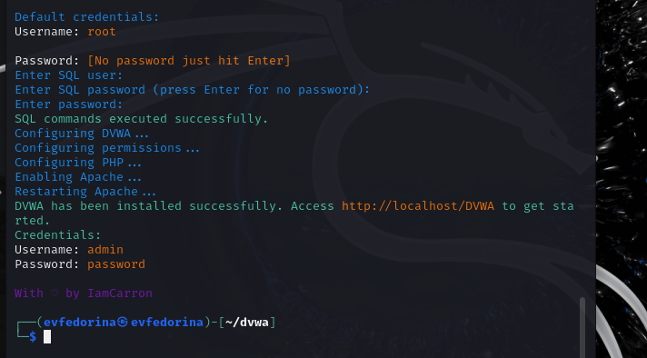
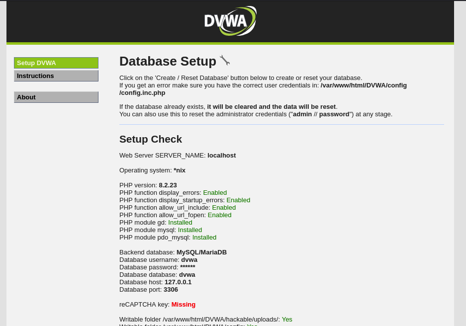

---
## Front matter
lang: ru-RU
title: Отчёт по 2 этапу индивидуального проекта
subtitle:   Установка DVWA
author:
  - Федорина Эрнест Васильевич
institute:
  - Российский университет дружбы народов, Москва, Россия

## i18n babel
babel-lang: russian
babel-otherlangs: english

## Formatting pdf
toc: false
toc-title: Содержание
slide_level: 2
aspectratio: 169
section-titles: true
theme: metropolis
header-includes:
 - \metroset{progressbar=frametitle,sectionpage=progressbar,numbering=fraction}
 - '\makeatletter'
 - '\beamer@ignorenonframefalse'
 - '\makeatother'
---

# Информация

## Докладчик

:::::::::::::: {.columns align=center}
::: {.column width="45%"}

  * Федорина Эрнест Васильевич
  * студент
  * Российский университет дружбы народов
  * [1032216454@pfur.ru](mailto:1032216454@pfur.ru)
  * <https://evfedorina.github.io/ru/>

:::
::: {.column width="25%"}

:::
::::::::::::::

## Цель работы

Установить DVWA в гостевую систему к Kali Linux.

## Теоретическое введение

DVWA - это программный проект, который намеренно включает в себя уязвимости безопасности и предназначен для образовательных целей.

# Выполнение лабораторной работы

## Установка DVWA по скрипту

Начало установки  (рис. [-@fig:001])

{#fig:001 width=50%}

## Установили DVWA

Завершение установки (рис. [-@fig:002])

{#fig:003 width=50%}

## Вошли в веб-приложение

Проверка работы веб-приложения (рис. [-@fig:003])

{#fig:003 width=50%}

# Выводы

Установили DVWA в гостевую систему к Kali Linux.